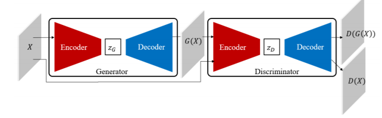
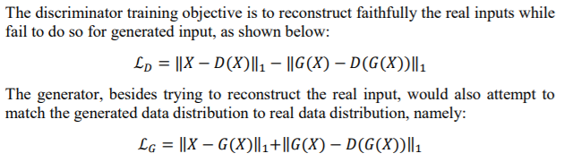

# Anomaly Detection with Adversarial Dual Autoencoder

[paper](https://arxiv.org/pdf/1902.06924)  
[code]()

---
* Overview
  * GAN 학습시에 latent space에 대한 reconstruction 로스를 추가하거나discriminator를 autoencoder로 만들 때 학습이 더 잘된다는 연구 결과를 바탕으로 만듬
  * GAN의 학습이 잘 이루어져야 정상 이미지에 대한 모델링이 잘 되는 것이기 때문에 이를 GAN 기반 anomaly detection에 도입
  * ALOCC 논문과 비슷한데 discriminator가 autoencoder 형식이라는 차이가 있음 

* method  

  * loss function  

  * score = $||\hat{x}-D(G(\hat{x}))||_{2}$  
