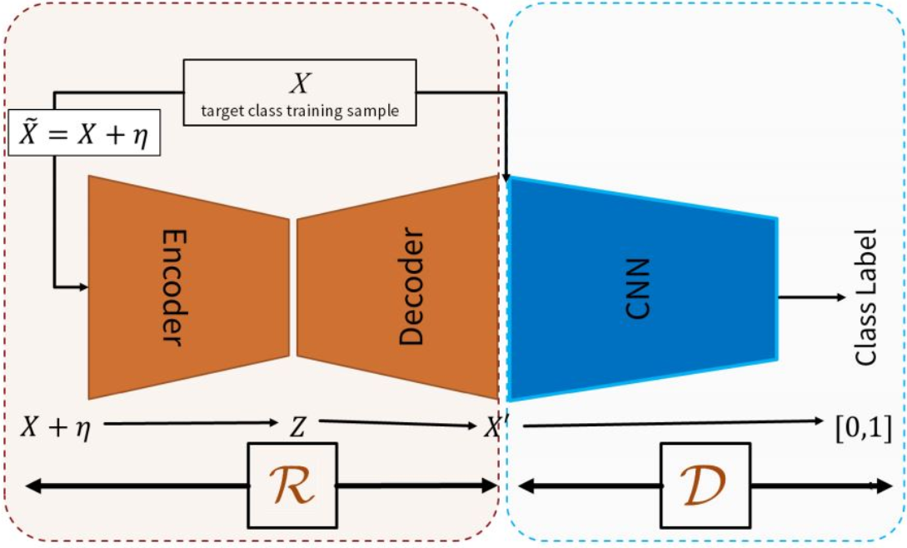

# Adversarially learned one-class classifier for novelty detection

[paper](http://openaccess.thecvf.com/content_cvpr_2018/papers/Sabokrou_Adversarially_Learned_One-Class_CVPR_2018_paper.pdf)  
[code](https://github.com/khalooei/ALOCC-CVPR2018)

---
* overview
  * 주어진 이미지를 reconstuct하고 이 output을 이용해 discriminator가 anomaly detector가 됨
  * reconstruction 데이터를 negative data로 간주하고 discriminator 학습
  * anomaly score를 계산할 때 reconstruction 결과를 이용해 판단함
  
* method
