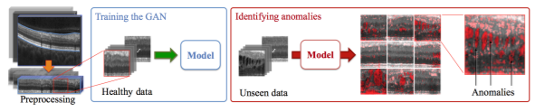
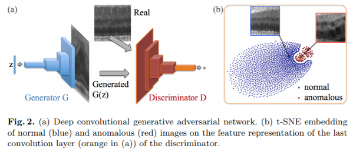
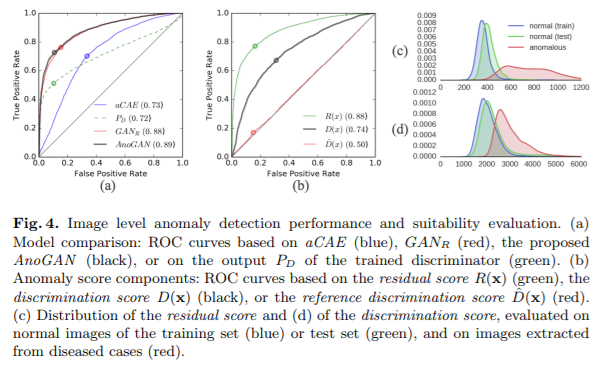

# Unsupervised Anomaly Detection with GANs to Guide Marker Discovery

[paper](https://arxiv.org/pdf/1703.05921.pdf)  
[code](https://github.com/LeeDoYup/AnoGAN)

---
* Overview
  * Propose adversarial training of a generative model of normal appearance and a coupled mapping schema that enables the evaluation of novel data to identify anomalous images and segment anomalous regions within imaging data.  

* Method  

  * GAN은 정상 이미지를 생성하도록 학습하고, 이를 이용해 비정상 이미지인지 검출하는데 이용
  * latent space 상에서 문제를 다루기 때문에 generator의 inverse funcion이 필요(autoencoder의 encoder 역할)
  * 이를 위해 style transfer와 같이 back-propagation으로 z 값을 찾는 과정이 필요
    - Residual loss  
$L_{R}(z_{\gamma}) = \sum |x-G(z_{\gamma})|$
    - Discriminator loss with feature matching  
$L_{D}(z_{\gamma}) = \sum |f(x)-f(G(z_{\gamma}))|$
  * Anomaly를 찾는 방법
    - z 값을 찾는 과정을 수행
    - 마지막 z의 loss값을 계산하여 이를 anomaly score로 활용

* Experiments  

  - preprocessing
