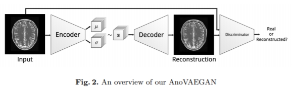
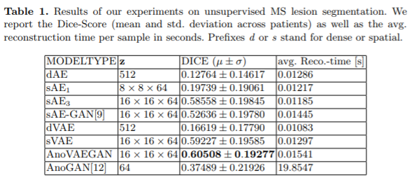

# Deep Autoencoding Models for Unsupervised Anomaly Segmentation in Brain MR Images

[paper](https://arxiv.org/pdf/1804.04488.pdf)  
[code](https://github.com/bumuckl/AutoencodersForUnsupervisedAnomalyDetection)

---
* Overview
  * AnoGAN의 복잡하고 높은 해상도의 이미지를 생성하는데 부족한 부분을 Spatial VAE로 보강
  * 또한, inference 단계의 optimization 과정이 필요없음
  * 실험 결과가 월등하게 높게 나오는데 anogan학습에 optimization 횟수를 100으로 함(원저자는 500)

* Model  

  - 흔히 생각하는 vae, gan의 혼합 모델이라고 보면됨
  - 추가적인 postprocessing이 본 연구의 주요 포인트로 생각됨(아래내용 검토 필요)
    - False positive를 줄이기 위한 작업
    - 5x5x5 median filter 적용
    - eroded brain mask를 곱해 작은 차이의 residual 없애기(?)

* Anomaly Detection
  - reconstruction 결과와 test image사이의 l1-loss를 이용해 anomaly 검출 시행

* Experiments  

