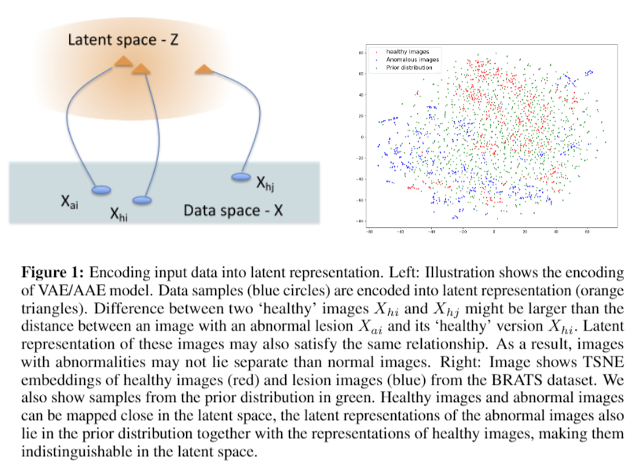

# Unsupervised Detection of Lesions in Brain MRI using constrained adversarial auto-encoders

[paper](https://arxiv.org/abs/1806.04972.pdf)
[code](https://github.com/aubreychen9012/cAAE)

---
* Overview
  * Adversarial autoencoder에 병변이 있는 이미지와 동일한 이미지의 병변이 없는 이미지를 latent 상에서 가깝게 만들어주는 constraint를 추가해서 학습  
  * latent space상에서 정상 이미지와 비정상 이미지가 분리되지 않고 함께 존재하도록 만들어줌

* method
  * lesion은 전체 이미지 중에서 일부에만 존재하기 때문에 reconstruction결과가 정상 이미지와 비슷하고 병변이 있는 부분만 달라져야함
  * 따라서 입력 이미지와 reconstruction 이미지가 latent space 상에서 근처에 있어야 함  
$Loss_{auto-encoder}=||X_{h}-X_{h}^{\prime}||^{2}+\lambda||z_{h}-z_{h}^{\prime}||^{2}$  
  * query image와 reconstruction image의 차이로 lesion detection 수행 