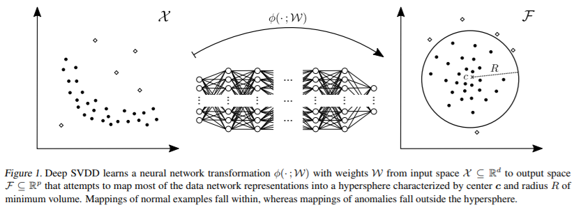
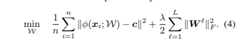

# Deep One-Class Classification
[paper](http://proceedings.mlr.press/v80/ruff18a.html)  
[code]()

---
* Overview
  * Support Vector Data Description (SVDD) 기법을 deep learning 모델로 치환하는 방법  
  * 정상 이미지는 hypersphere의 중점에 모이고, 비정상 이미지는 멀어진다는 가정으로 사용  

* method
  * soft-boundary Deep SVDD의 loss를 one-class문제에 맞게 수정하여 사용  
    * 기존 loss와 다른 점은 hypersphere의 radius를 작게 만들게 하는 부분이 없어졌는데, one-class 문제의 경우 대부분의 데이터가 정상 이미지이기 때문에 센터와의 거리를 줄이는 것으로 충분함 (거리를 줄이기 위해서는 nn이 공통적인 특징을 잡아내야만 함)

  * 센터와의 거리를 anomaly score로 활용
  * bias를 network에서 사용하지 않고, relu같은 unbounded activation function을 사용해야함
  * fixing center를 쓰는 것도 나쁘지 않음.
    * 초기 input data의 일부의 평균을 센터로 사용