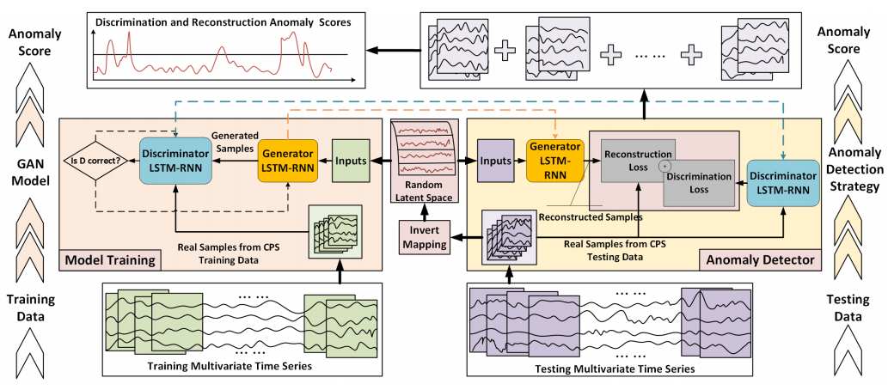

# MAD-GAN: Multivariate Anomaly Detection for Time Series Data with Generative Adversarial Networks

[paper](https://arxiv.org/pdf/1901.04997.pdf)  
[code]()

---
* Overview
  * 전체 시퀀스 중에서 비정상인 부분은 일부분만 있을 가능성이 높기 때문에 시퀀스를 여러개의 segment로 나눔
  * 각 segment에 AnoGAN을 적용하여 Anomaly score를 계산
  * 각 timestep에 대한 anomaly score는 각 timestep이 포함된 segment들의 anomaly score의 평균으로 사용

* method

