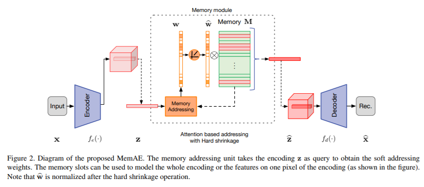

# Memorizing Normality to Detect Anomaly: Memory-augmented Deep Autoencoder for Unsupervised Anomaly Detection

[paper](https://arxiv.org/pdf/1904.02369v1.pdf)  
[code]()

---

* Overview
  * anomaly가 영역이 매우 조금일 때, anomaly 이미지의 패턴이 정상과 크게 다르지 않을때, 또는 디코더가 너무 강력해서 reconstruction이 잘 될수있음
  * 본 연구에서는 external memory를 도입해 query image의 latent 값과 가까운 memory 값을 기반으로 reconsruction 수행

* method
  * Encoder의 output을 기반으로 memory addressing을 하며, 최종 output을 이용해 decoder를 통해 reconstruction 수행
  * memory addressing은 sparse addressing을 수행
    * 이를 강요하기 위해 entropy regularization 추가
  * memory module에 write를 하는 방식이 기술되어있지않음
    * sparse memory write
  
