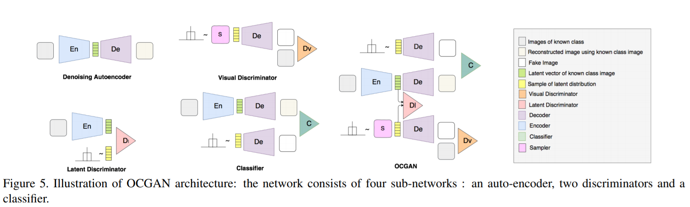
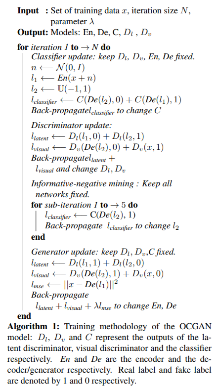

# OCGAN: One-class Novelty Detection Using GANs with Constrained Latent Representations

[paper](https://arxiv.org/abs/1903.08550.pdf)  
[code]()

---
* Overview
  * 기존의 AAE의 단점은 모든 latent space를 training시에 다루지 않기 때문에 latent space 상에서 정상과 비정상 이미지가 모두 존재하게 된다. 따라서, 정상 이미지와 유사한 비정상 이미지는 resconstruction loss가 값이 작게 나올수가 있음.
  * AAE 구조에 추가적인 classifier가 anomaly라고 분류하는 latent 영역을 찾아내고 이 영역에서도 사실적인 이미지를 생성하도록 학습
  * 학습된 latent space 안에서는 in-class sample만 생성하게함

* model  
  * 모델은 크게 Denosing autoencodeer, latent discriminator, visual discriminator, classifier 4개로 구성되어있음
  * latent discriminator와 visual discriminator는 AAE와 GAN에서 흔히 쓰는 모델로 차이가 없음
  * classifier는 input image에서 나온 latent와 random  latent를 입력값으로 생성된 이미지를 분류하는 분류기를 의미함
    * 이를 통해 전체 latent space에서 다른 클래스를 가지는 부분을 조금이라도 없애주는 역할을 함. 
  * 학습된 classifier를 이용해서 informative negative mining이라는 것을 수행함
    * 이를 통해 latent space 상에서 out-of-distribution을 만들어내는 영역을 찾아내고, 이영역에서 만들어진 이미지로 autoencoder 학습
    

