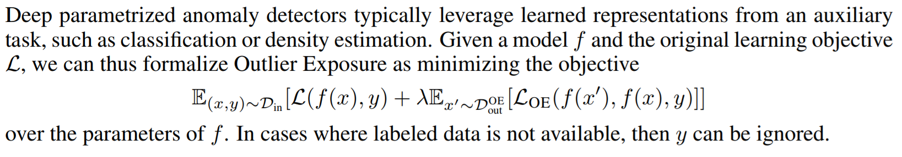

# Deep Anomaly Detection with Outlier Exposure

[paper](https://arxiv.org/abs/1812.04606.pdf)  
[code](https://github.com/hendrycks/outlier-exposure)

---
* Overview
  * OOD (Out-Of-distribution) detector가 와 outlier exposure dataset이 주어진 상황에서 사용하는 방법론
  * auxiliary task (classification, dentisy estimation) task에 대한 모델 $f$와 loss function $L$이 주어져 있을 때 사용하는 방법
  * 제안 방법을 통해 좀 더 general하게 unseen distribution을 저 잘 찾는다는 것을 실험을 통해 보여줌

* method
  * loss function  

