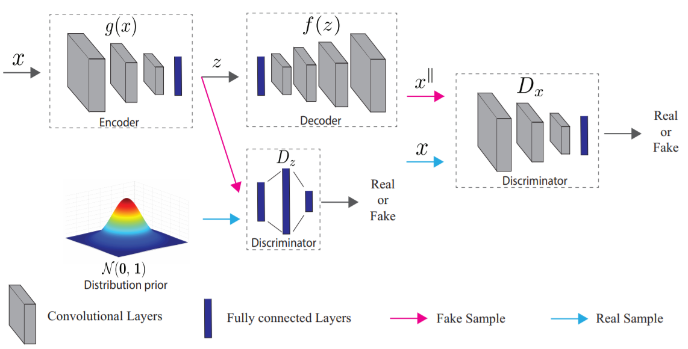

# Generative Probabilistic Novelty Detection with Adversarial Autoencoders

[paper](https://arxiv.org/pdf/1807.02588.pdf)  
[code]()

---
* Overview
  * reconstruction manifold는 데이터의 manifold하고는 완벽하게 같을수가 없다. 차이가 존재하는데 주어진 방법은 측정된 차이가 이 차이와 크게 차이가 없는지를 추가적으로 모델링하는 효과가 있다.
  * jacobian에 대한 내용부터 자세하게 추후 작성..

* method
  * 네트워크 구조 및 학습 방법은 latent와 image에서 활용되는 2개의 discriminator가 있는 AAE와 같음  

  * anomaly score  
$P_X(\bar{x})=P_{W^{||}}(\bar{w}^{||})P_{W^{\perp}}(\bar{w}^{\perp})$
  * 확률값을 계산하는 방법은 아래와 같다.