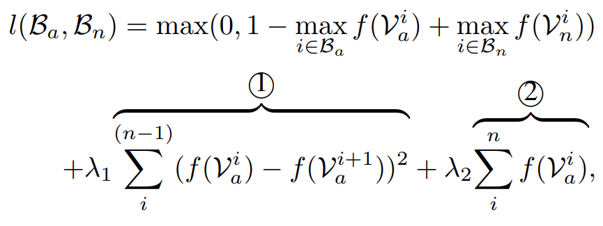

# Real-world Anomaly Detection in Surveillance Videos

[paper](http://openaccess.thecvf.com/content_cvpr_2018/papers/Sultani_Real-World_Anomaly_Detection_CVPR_2018_paper.pdf)  
[code]()

---
* Overview
  * time-series에서 일부 시간에만 anomaly state라는 가정이라는 점이 들어가있음
  * 감시 동영상에 대한 새로운 데이터 셋을 제시

* method
  * 정상, 비정상의 유무는 알지만 어느 위치인지는 모르는 데이터일 때 사용
  * 비디오를 시간에 따라 segment를 나눠 positive bag과 negative bag을 만듬
  * 각각의 segment를 pre-trained model로 피쳐를 뽑음
  * 뽑힌 피쳐를 이용해 각각의 segment의 anomaly score를 계산하는 네트워크를 통해 anomaly score를 계산
  * 아래의 ranking loss를 기반으로 학습을 진행
   
