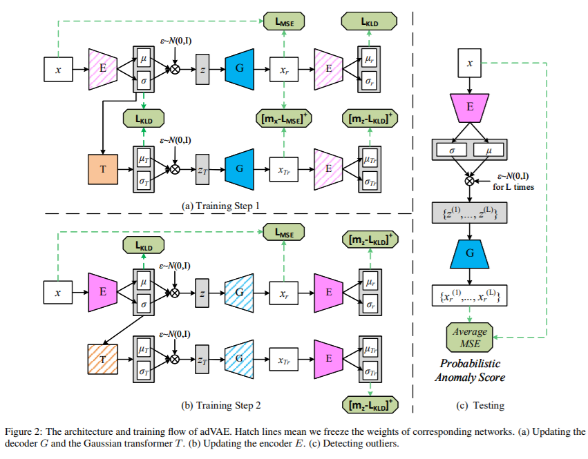
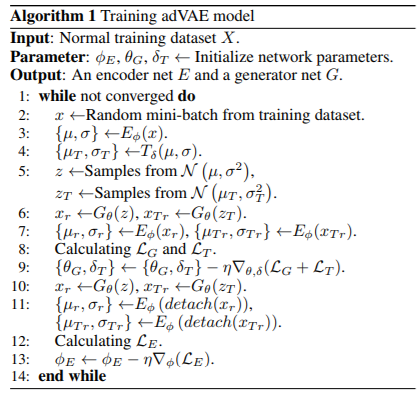

# Self-adversarial Variational Autoencoder with Gaussian Anomaly Prior Distribution for Anomaly Detection

[paper](https://arxiv.org/abs/1903.00904.pdf)  
[code]()

---
* Overview
  * VAE based anomaly detection에 anomaly prior transformer를 추가하여 anomaly detection 수행
  * generator가 discriminator의 역할을 하며, transformer가 anomaly latent를 만들어냄
    * latent 상에서 anomaly를 반별하는 부분이 들어가게 됨

* method  

* algorithm  
 

* 약간 방법론에 대한 수리적인 검토가 필요해보임.(loss function에 대한 설명이 부족함)