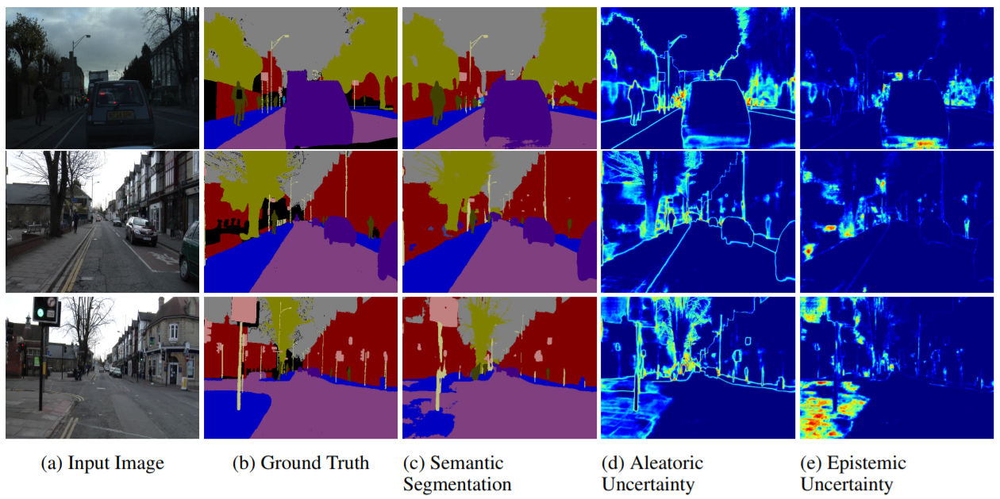

# What Uncertainties Do We Need in Bayesian Deep Learning for Computer Vision?

[paper](https://papers.nips.cc/paper/7141-what-uncertainties-do-we-need-in-bayesian-deep-learning-for-computer-vision.pdf)  
[code]()

---
* Overview
  * Uncertainty의 종류는 크게 2가지가 있음
    * Aleatoric uncertainty: observation 과정에서 발생하는 uncertainty로 데이터가 가지고 있는 불확실성임
    * Epistemic uncertainty: 모델이 가지고 있는 불확실성 -> 데이터가 늘어나면 줄일 수 있음
  * 본 연구에서는 이 둘을 동시에 측정할 수 있는 방법을 제시하고, image segmentation에서 측정된 값이 어떻게 나타나는지 보여줌

* method
  * density network를 사용하며(aleatoric), dropout을 이용해 bayesian neural network를 학습함(epistemic)
  * Dropout as bayesian neural network 방식을 적용하여, epistemic uncertainty 측정

* result
  * 성능 향상
    * 매 input마다 sigma(aleatoric uncertainty)를 측정하게 되는데 이 값이 크면 로스에서 덜 신경쓰게 됨 --> 즉, input에 따라 loss가 자동적으로 weight가 되는 효과. 
      * 예를 들면 segmentation에서 경계는 실제 정답이 다양하기 때문에 aleatoric(heteroscedastic) uncertainty가 커지고 loss의 영향을 줄이게 됨  
  
