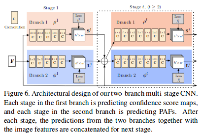
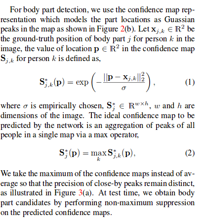

# Realtime Multi-Person 2D Pose Estimation using Part Affinity Fields
---
* overview
  *  df  

  * architecture   
    

    
  * Methods
    * confidence maps for part detection   
       
    * part affinity fields for part association
