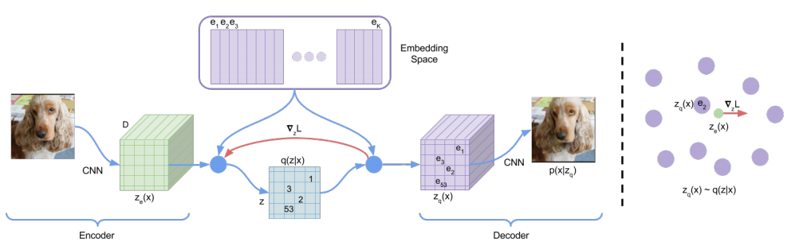

# VQVAE and VQVAE-2
* vector quantization 기법이 적용된 VAE 모델의 전반적인 개론
* Structural music generation에 적용하기 위해 기본적인 특징 파악 필요

* vqvae
    * [paper](https://arxiv.org/pdf/1711.00937.pdf)   
    * [code](https://github.com/MishaLaskin/vqvae)
* vqvae-2
    * [paper](https://arxiv.org/pdf/1906.00446.pdf)   
    * [code](https://github.com/rosinality/vq-vae-2-pytorch)

---
* Overview
  * 기존 latent 모델에서 사용하던 continuous latent가 아닌 discrete latent를 활용해 posterior collapse를 방지
  * 학습된 discrete space를 generation하는 prior 모델을 ae를 학습한 뒤에 추가적으로 학습하여, ancestral sampling을 하게 됨
  * discrete latent는 확률분포를 따르지 않기 떄문에, deterministic한 decoder를 사용하게 됨  
  

* 특징
  * 학습시에 discrete 한 부분은 argmin 함수가 있어서, 단순 sgd로 학습안됨
    * straight-through gredient estimation을 이용해 gradient를 흘림

* optimization trick
  1. test