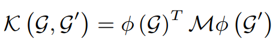

# Deep Graph Kernels

[paper](https://dl.acm.org/citation.cfm?id=2783417)  
[code]()

keyword: Graph kernel, 

---
* Overview
  * 기존 Graph kernel의 단점을 개선한 방법
    * $M$을 도입하여, 커널이 비슷한 graph를 similar하게 나타내는 커널을 학습(M이 없으면, diagonal 부분만 값이 커지게 됨)
  * $M$이라는 subgraph 간의 유사도를 측정해 추가함으로써, 위의 문제를 해결하고자 함
  * subgraph를 어떻게 표현하느냐, 어떻게 kernel을 적용하느냐에 따라서 다양하게 적용가능함

* 기존 graph kernel method에 대한 정리 - [참고자료](https://www.ethz.ch/content/dam/ethz/special-interest/bsse/borgwardt-lab/documents/slides/CA10_WeisfeilerLehman.pdf)
  * Walk based graph kernels
    * 두 그래프의 공통적인 walk 갯수를 세서 이를 사용
  * Product graph kernels
    * 두 graph의 product graph를 생성한 뒤에 walk 기반 계산 
    * 계산량이 $O(n^6)$로 매우 많음 
  * Sortest path kernel
  * Graphlet kernel
    * 그래프의 subgraph들에 대해 graphlet의 갯수를 count해서 정규화 후에 이들의 내적으로 비교 
  * Weisfeiler-Lehman kernel
    * iteration을 반복하여, 노드와 neighborhood의 label을 이용해서 새로운 라벨과 노드를 만들어냄
    * 그 이후에 label의 co-occurence를 세서 두 그래프의 kernel값을 계산
  * Subgraph kernel
    * $k_x(G_1,G_2)=\sum_{G_1}\sum_{G_2}\lambda_s(G^{'}_{1})k_\cong(G^{'}_{1}, G^{'}_{2})$
  * Subgraph matching kerenl
    * 

* method
  * $M$을 어떻게 사용하고 학습하느냐를 본 연구에서 제안
    * sub-structure similarity via edit distance
      * sub-graph들에 대해 edit distance를 계산하여 $M$ 계산
    * sub-structure similarity via learning
      * word vector를 학습
      * subgraph들의 embedding을 학습하는데 이를 word vector를 학습할 때 사용하는 방법을 사용하며, 이를 위해 subgraph의 co-occurence를 정의해줘야 하는데 이를 kernel의 종류에 따라 적합하게 적용함
        * 모든 graph kernel에 대해서 co-occurence만 정의해주면 어디든지 적용 가능
  * 각 그래프에 대해 subgraphs를 생성하고, 이들에 대한 $M$을 계산한 뒤에 위 수식에 따라 kernel matrix를 계산

* result
  * 계산 양이 많기 때문에 이를 줄이기 위한 방법이 필요