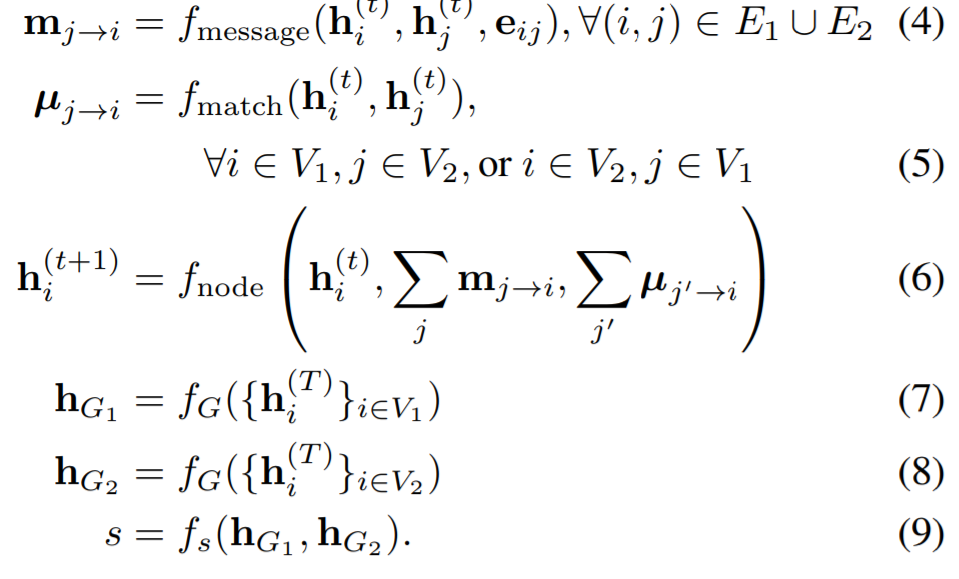
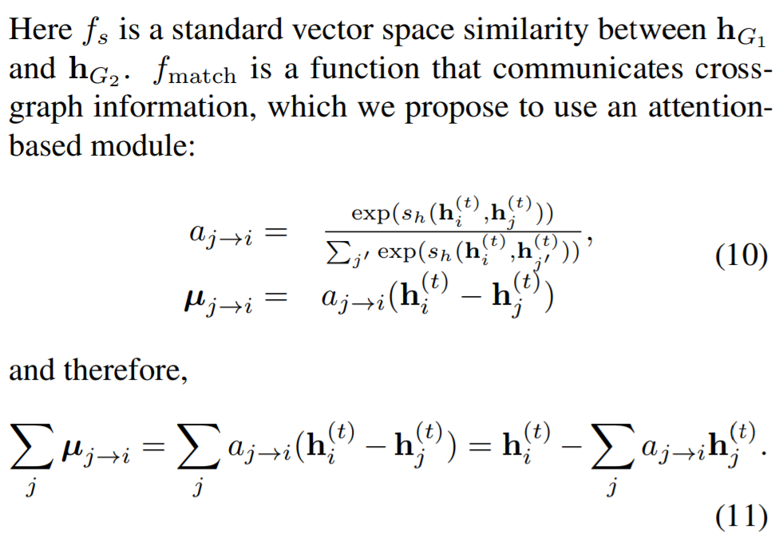
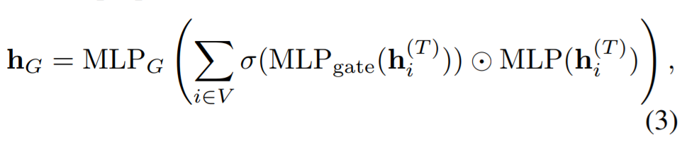
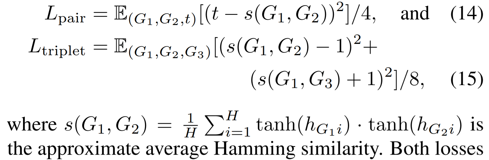
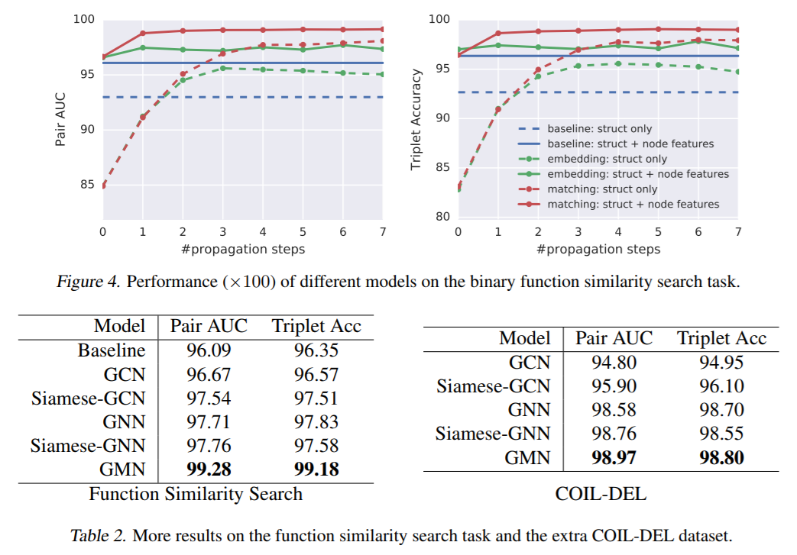

# Graph Matching Networks for Learning the Similarity of Graph Structured Objects

[paper]()  
[code]()

---
* Overvew
  * 최근에 제안된 GNN을 이용하여, 각 graph의 embedding을 학습하고 이를 이용해 similarity를 계산하는 방법론을 제안
  * 이 때, 2개의 graph가 주어졌을 때, 이들간의 정보를 주고받아 similarity를 계산하는데 더 적합한 embedding을 학습하도록 함

* method
  * 제안된 모델은 graph embedding network와 graph matching network 2가지가 있음
    * 전자는 그래프간의 정보 전달없이 각 node의 embedding을 학습 후 aggregation 수행
    * 후자는 그래프간의 정보 전달을 포함하여 각 node의 embedding을 학습 후 aggregation 수행
  * node의 embedding을 업데이트 하는 방식이 달라짐
    * $m_{j \rightarrow i}$ : 같은 그래프내의 정보전달, $\mu_{j \rightarrow i}$ : 다른 그래프 사이의 노드 간의 정보전달  
    * 아래 수식은 graph matching network의 구성요소와 계산하는 방법

 
 
  * loss function의 경우 pair loss와 triplet loss를 모두 사용하여 비교
 

* result
 
