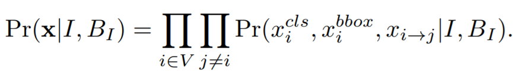

# Scene Graph Generation by Iterative Message Passing

[paper](http://openaccess.thecvf.com/content_cvpr_2017/html/Xu_Scene_Graph_Generation_CVPR_2017_paper.html)  
[code]()

---
* Overview
  * Scene graph generation이란 주어진 이미지에 대해서 제안된 object region에 대해 class, bounding box를 추론하고 object들의 pair들에 대한 relation을 추론하는 문제로 볼 수 있음
