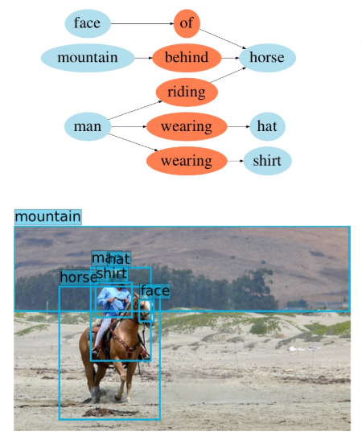

# Scene Graph Generation 문제에 대한 요약

## Scene Graph Generation은 무엇이며, 어떻게 활용 되는가?
* A scene graph is a structured representation of an image, where nodes in a scene graph corrrespond to their pairwise relationships between objects
* 이미지를 하나의 그래프로 표현하는데, 이 그래프는 이미지 내의 object(name, bounding box)와 이들 간의 relationship(name)을 나타냄
  * Scene graph는 object를 알아야 되기 때문에 object detection model들과 관련성이 높음
* Scene graph는 이미지를 설명하는 paragraph에 대한 축약본으로 생각할 수 있으며, image retreival, scene synthesis, VQA 등 다양한 문제에서 활용이 가능하다.
* 해당 연구분야는 scene graph generation, scene graph를 활용한 응용문제로 크게 구분이 가능함.
  

## Dataset
* Visual Genome dataset
  * 108,077장의 이미지가 있으며, 평균적으로 25개의 object와 22개의 relation으로 구성되어있음
* clevr dataset
  * 가상으로 어느정도 만들어진 데이터셋으로 도형과 이들의 위치적 관계를 relation으로 가지는 데이터셋
    * 각각의 도형은 3d_coords, pixel_coords, rotation, size, color, material shape의 attribute들을 가지고 있음
    * relation은 adjacency lists로 표현되며, i번째 object의 왼쪽에 j번째 object가 있을 경우 s['relations']['left'][i] 리스트가 j를 element로 가지면 됨
    * 추가적인 relation의 생성이 가능은 할 것으로 보임
    * question과 answer도 데이터셋에 포함되어있음

## Method
* Graph generation에 사용되는 방법과 이를 이용하는 방법으로 크게 구분이 가능할 것으로 보임 --> 추가적인 survey 후에 체계적으로 정리 예정
  * Graph neural network, conditional random field, ...
* Scene graph generation
  1. Region Proposal Network (RPN)을 통해 object의 bounding box proposal ($B_I$)을 제안
  2. 각 proposal에 대해 object class와 bounding box를 정확하게 계산
  3. 각 proposal들의 pair에 대해 relation을 추론함

* Application 및 구체적인 방법론은 아래 기존 연구를 참고할 것

## Previous research
  * Scene graph generation  
    [[1] Scene Graph Generation by Iterative Message Passing](./IMP/summary.md)  
  * VQA
  * Image retreival
  * Scene synthesis 

