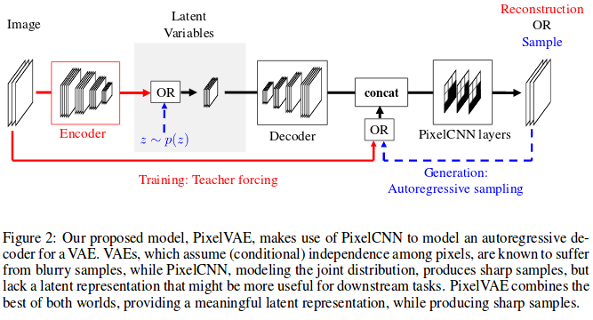
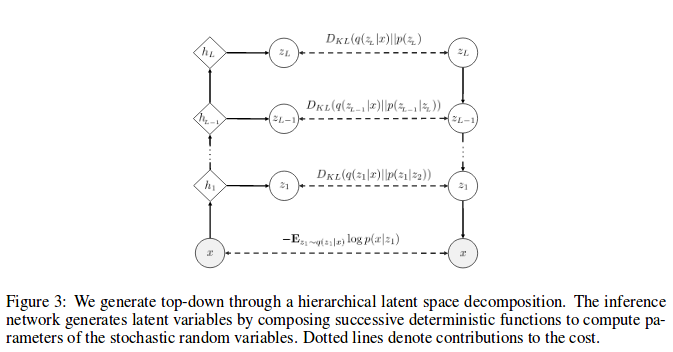

# PixelVAE: A Latent Variable Model For Natural Images
---
[paper](https://openreview.net/pdf?id=BJKYvt5lg)   
[code]()
* overview
  * Previous PixelCNN has several problems
      * computationally expensive because of no downsampling
      * do not learn a latent representation of the data
  * contribution
      * a latent variable model which combines the largely complementary advantages of VAEs and PIxelCNNs
      * extend PIxelVAE to a hierarchical model with ultiple stochastic layers and autoregressive decoders at each layer
      * extensive experiment on several datasets with superior results

* model structure
  * As opposed to most VAE decoders that model each dimension of the output independently, use a conditional PixelCNN in the decoder.
  * By conditioning on latent variable(z), the model can captures global structure at a much lower computational cost than a standard PixelCNN implementation   

* To-Do
  * implement --> see more detail
