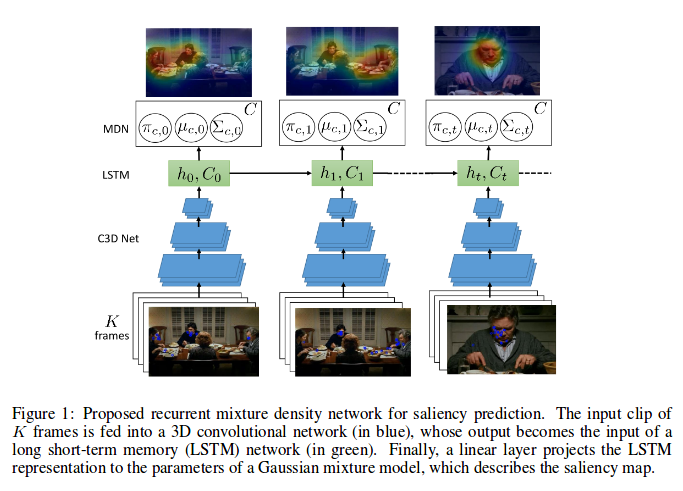
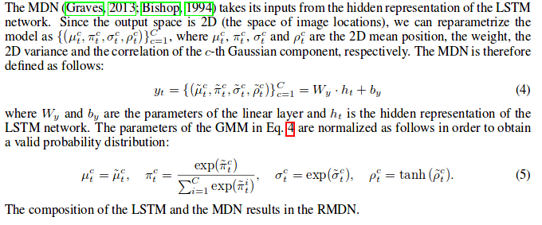
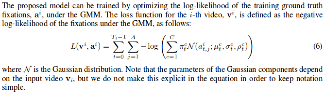
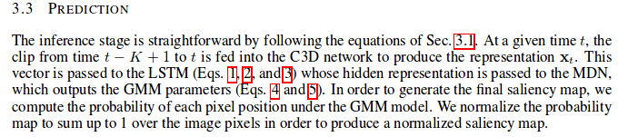

# Recurrent Mixture Density Network for Spatiotemporal Visual Attention
---
* overview
  * Model visual attention with a mixture of Gaussians at each frame
  *

* model

  * input of lstm for each timestmap is the result of CNN
  * output of each timestamp

  * loss function

  * prediction

