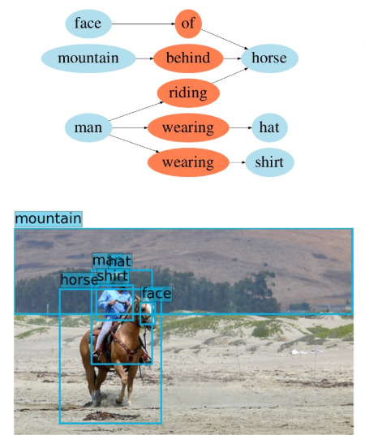

# Scene Graph Generation 문제에 대한 요약

## Scene Graph Generation은 무엇이며, 어떻게 활용 되는가?
* A scene graph is a structured representation of an image, where nodes in a scene graph corrrespond to their pairwise relationships between objects
* 이미지를 하나의 그래프로 표현하는데, 이 그래프는 이미지 내의 object(name, bounding box)와 이들 간의 relationship(name)을 나타냄
* Scene graph는 이미지를 설명하는 paragraph에 대한 축약본으로 생각할 수 있으며, image retreival, scene synthesis, VQA 등 다양한 문제에서 활용이 가능하다.
* 해당 연구분야는 scene graph generation, scene graph를 활용한 응용문제로 크게 구분이 가능함.
  

## Dataset
* Visual Genome dataset
  * 108,077장의 이미지가 있으며, 평균적으로 25개의 object와 22개의 relation으로 구성되어있음
* NYU Depth v2 dataset

## Method
* Graph neural network, conditional random field, 
* 구체적인 방법론은 아래 기존 연구를 참고할 것

## Previous research
  * Scene graph generation  
    [[1] Scene Graph Generation by Iterative Message Passing](./IMP/summary.md)  
  * VQA
  * Image retreival
  * Scene synthesis 